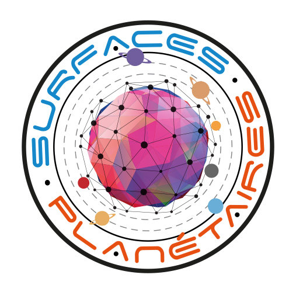

Pole Surfaces Planétaires
=========================

Ce dépôt contient l'ensemble des fichiers sources permettant de générer le guide du [pole surfaces planétaires](https://pole-surfaces-planetaires.github.io).
Toutes remarques, suggestions ou modifications sont les bienvenues et vivement encouragées.
N'hésitez pas à consulter [cette page](CONTRIBUTING.md) pour savoir comment participer à sa rédaction.

Licence
-------
Ce guide est distribué sous [licence ouverte 2.0](License.md). Il peut être copié, modifié et redistribué librement sans autorisation préalable sous réserve de mentionner explicitement sa parentalité.

Crédits
-------
Le Logo du pole surfaces planétaires a été réalisé par le [CNES](https://cnes.fr). Tous les droits sont réservés.
